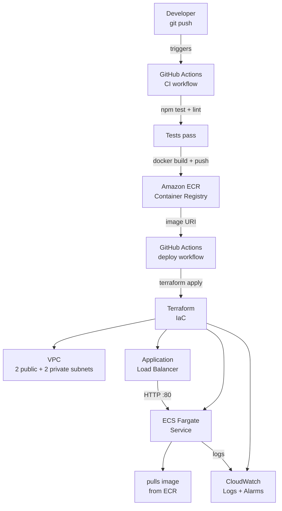

# CI/CD Pipeline Reference - Terraform + GitHub Actions + AWS ECS Fargate

A production-ready reference repo demonstrating how to take a Node.js app from
zero to a fully automated AWS deployment. Everything is IaC (Terraform) and
every push to `main` triggers a build-test-deploy pipeline via GitHub Actions.

---

## Architecture



### Component summary

| Component | Purpose | Cost estimate |
|-----------|---------|---------------|
| **ECS Fargate** | Runs container tasks - no EC2 to manage | ~$15/mo (256 CPU / 512 MB, 1 task) |
| **ECR** | Private Docker registry | ~$0.10/GB/mo |
| **ALB** | Public HTTPS entry point, health checks | ~$16/mo |
| **VPC** | Isolated network; public + private subnets | Free |
| **CloudWatch** | Log retention (14d) + CPU/memory alarms | ~$1-3/mo |
| **Total** | Small production workload | **~$32-35/mo** |

---

## Repository layout

```
.
├── app/ # Node/Express application
│ ├── src/
│ │ ├── index.ts # Entry point
│ │ └── __tests__/ # Jest tests
│ ├── package.json
│ └── tsconfig.json
├── terraform/ # Infrastructure as code
│ ├── main.tf # Root module - wires everything together
│ ├── variables.tf # Input variables
│ ├── outputs.tf # Useful outputs (ALB URL, ECR URL, etc.)
│ ├── versions.tf # Provider pinning + optional S3 backend
│ └── modules/
│ ├── vpc/ # VPC, subnets, IGW, optional NAT
│ ├── ecr/ # ECR repository + lifecycle policy
│ ├── ecs/ # Cluster, task definition, Fargate service, ALB
│ └── cloudwatch/ # Log group + CPU/memory alarms
├── .github/
│ └── workflows/
│ ├── ci.yml # Lint → test → build → push image (on push/PR)
│ └── deploy.yml # Terraform apply → force ECS redeploy (on main/tag)
├── scripts/
│ ├── dev.sh # Run app locally with ts-node
│ ├── build.sh # Compile TypeScript
│ ├── local-docker.sh # Build + run the production Docker image locally
│ └── bootstrap-state.sh # One-time: create S3 bucket + DynamoDB for TF state
├── Dockerfile # Multi-stage build (build → runtime)
└── README.md
```

---

## CI/CD pipeline flow

### On every push / pull request
1. **`ci.yml`** - lint + test the app
2. **If pushing to `main` or tagging** - build Docker image and push to ECR

### On merge to `main`
3. **`deploy.yml`** - auto-deploy to **staging**:
 - `terraform plan` + `terraform apply`
 - `aws ecs update-service --force-new-deployment`
 - Wait for service stability

### Production deploys
- Trigger `deploy.yml` manually via GitHub Actions UI
- Choose `prod` and enter the image tag (e.g. `v1.2.3` or `sha-abc1234`)

### Rollback
```bash
# Re-deploy a previous image tag by triggering the workflow manually,
# or via CLI:
aws ecs update-service \
 --cluster hello-app-prod-cluster \
 --service hello-app-prod-service \
 --task-definition hello-app-prod-task:<previous_revision>
```

---

## Local development

```bash
# Run with ts-node (no Docker)
./scripts/dev.sh

# Build TypeScript
./scripts/build.sh

# Build + run the production image locally
./scripts/local-docker.sh
```

The app exposes:
- `GET /` - hello message with env + version
- `GET /health` - health check (used by ALB)

---

## To actually deploy this to AWS

### Prerequisites

| Requirement | Notes |
|-------------|-------|
| AWS account | Free tier works for testing |
| AWS CLI configured | `aws configure` or SSO |
| Terraform >= 1.7 | `brew install terraform` |
| Docker | For local image builds |
| GitHub repo | To trigger Actions |

### Step 1 - Bootstrap Terraform remote state

```bash
export AWS_REGION=us-east-1
export TF_STATE_BUCKET=your-org-tf-state # must be globally unique
./scripts/bootstrap-state.sh
```

Then uncomment the `backend "s3"` block in `terraform/versions.tf` and fill in
your bucket name.

### Step 2 - Create an IAM role for GitHub Actions (OIDC)

GitHub Actions authenticates to AWS via OIDC - no long-lived access keys.

```bash
# Minimal IAM policy needed:
# - ecr:GetAuthorizationToken, ecr:BatchCheckLayerAvailability,
# ecr:InitiateLayerUpload, ecr:UploadLayerPart, ecr:CompleteLayerUpload,
# ecr:PutImage
# - ecs:UpdateService, ecs:DescribeServices, ecs:RegisterTaskDefinition
# - iam:PassRole (for the ECS execution and task roles)
# - ec2:*, elasticloadbalancing:*, logs:*, cloudwatch:*
```

See [GitHub's OIDC docs](https://docs.github.com/en/actions/security-for-github-actions/security-hardening-your-deployments/configuring-openid-connect-in-amazon-web-services) for the trust policy.

### Step 3 - Add GitHub Actions secrets

In your repo → Settings → Secrets and variables → Actions:

| Secret | Value |
|--------|-------|
| `AWS_ACCOUNT_ID` | Your 12-digit AWS account ID |
| `AWS_DEPLOY_ROLE_ARN` | ARN of the OIDC role from Step 2 |

### Step 4 - First deploy

```bash
cd terraform
cp terraform.tfvars.example terraform.tfvars
# Edit terraform.tfvars - set environment = "staging"
terraform init
terraform plan
terraform apply
```

After `apply`, Terraform outputs the ALB DNS name. The ECR URL is also in the
outputs - set it in your tfvars as `app_image` for subsequent deploys, or let
CI/CD set it via `-var`.

### Step 5 - Push code and watch the pipeline

```bash
git push origin main
# → CI runs tests → builds image → pushes to ECR
# → deploy.yml applies terraform → forces ECS redeployment
# → ALB DNS is live within ~2 minutes
```

---

## Customising for your app

1. **Different app** - replace `app/` with your own code; update the `Dockerfile`
 `COPY` paths and `EXPOSE` port.
2. **HTTPS** - add an ACM certificate resource and update the ALB listener to
 port 443 in `modules/ecs/main.tf`.
3. **Private subnets** - uncomment the NAT Gateway block in
 `modules/vpc/main.tf` and move the ECS service to `var.private_subnets`.
4. **Multiple services** - add a second module call in `main.tf`; each service
 gets its own target group and listener rule.
5. **Secrets** - use AWS Secrets Manager and reference via `secrets` in the
 task definition container spec.

---

## Cost estimate

For a single staging environment running 24/7:

| Resource | $/mo |
|----------|------|
| ALB | ~$16 |
| ECS Fargate (0.25 vCPU / 0.5 GB, 1 task) | ~$11 |
| ECR storage (first 500 MB free) | ~$0 |
| CloudWatch logs (minimal volume) | ~$1 |
| NAT Gateway (if enabled) | ~$32 |
| **Total without NAT** | **~$28/mo** |
| **Total with NAT** | **~$60/mo** |

NAT is optional for this demo - tasks run in public subnets with
`assign_public_ip = true` to avoid the cost. Use private subnets + NAT for
production workloads.
